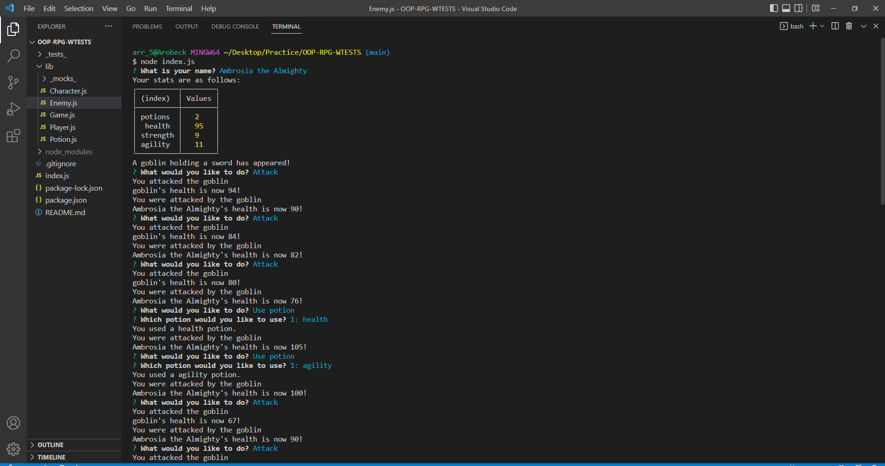

# OOP-RPG-WTESTS

 

 ## Description

I have started updating this project with the following that were not included in the original project:
* Adding a choose difficulty prompt allowing the user to choose the difficulty of the game.
    - Easy: 1 enemy,
    - Medium: 2 enemies,
    - Hard: 3 enemies.
* Added a flee prompt allowing the user to flee from the battle.
* Added a radnom enemy generator to generate a random enemy.

_Welcome to the Object-oriented programming's (OOP) version of a Role Playing Game! This game was created following along with the in class modules from Trilogy Education(2U)._ 

This application:
* is ran from the back-end and does not have a deployed page however adventure awaits you on the command line!

---

  ## Table of Contents
  
  - [Usage](#usage)
  - [Installation](#installation)
  - [Walk-through video](#walk-through)
  - [Screenshots](#screenshots)
  - [License](#license)
  - [Contributions](#how-to-contribute)
  - [Questions](#questions)

  ---

  ## Usage

Currently this application is able to:
* Create a new character
* View the character's stats
* Attack an enemy
* Use a potion to heal your character

---

  ## Installation

This project is ran through Node.js
* `clone the repository` 
*  `npm install` in the command line to install the required dependencies. 
*  open in the terminal and then `node index` to start the game!

  ---

  ## Walk-through
 
 Currently there is no walkthrough video of this application.

[link to whole video.]( "Whole walkthrough video")

 ---

  ## Screenshots

Here are some screen shots of this application.

    

  ---

  ## License

   MIT License

Copyright (c) [2022] [Amber Robeck]

Permission is hereby granted, free of charge, to any person obtaining a copy
of this software and associated documentation files (the "Software"), to deal
in the Software without restriction, including without limitation the rights
to use, copy, modify, merge, publish, distribute, sublicense, and/or sell
copies of the Software, and to permit persons to whom the Software is
furnished to do so, subject to the following conditions:

The above copyright notice and this permission notice shall be included in all
copies or substantial portions of the Software.

THE SOFTWARE IS PROVIDED "AS IS", WITHOUT WARRANTY OF ANY KIND, EXPRESS OR
IMPLIED, INCLUDING BUT NOT LIMITED TO THE WARRANTIES OF MERCHANTABILITY,
FITNESS FOR A PARTICULAR PURPOSE AND NONINFRINGEMENT. IN NO EVENT SHALL THE
AUTHORS OR COPYRIGHT HOLDERS BE LIABLE FOR ANY CLAIM, DAMAGES OR OTHER
LIABILITY, WHETHER IN AN ACTION OF CONTRACT, TORT OR OTHERWISE, ARISING FROM,
OUT OF OR IN CONNECTION WITH THE SOFTWARE OR THE USE OR OTHER DEALINGS IN THE
SOFTWARE.

  
  ---
  
  ## How to Contribute

     However you would like to contribute I always look forward to learning something new, feel free to email me!

  [Contributor Covenant](https://www.contributor-covenant.org/)

  ---

  ## Questions

* OR here

 

* OR here

